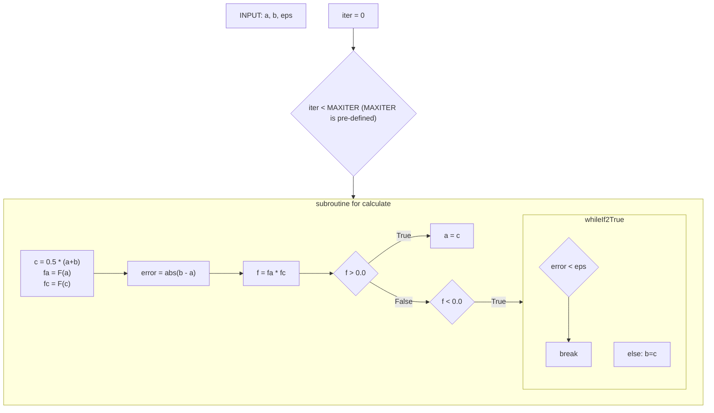

## Non-Linear Equations (비선형 방정식)

$f(x) = a^2x + bx + c = 0$ 꼴의 방정식의 근을 구하는 문제를 비선형 방정식이라고 한다.  
수치해석에서는 $f(x)  = 0$를 만족하는 $x$를 구하는 것을 목표로 한다.  
이를 위해 다음과 같은 방법을 사용할 수 있다.

- 구간법
    + 이분법
    + 가위치법
- 개구간법
    + 고정점 반복법
    + Newton-Raphson법
    + 할선법

#### 이분법
> 구간법 중 하나. 구간법은 범위 $[a, b]$를 정하여 해를 찾는다.  
> 그래프를 사용하여  접근하기 때문에 실제값을 구하는 데에는 한계가 있지만,  
> 대략적인 추정 값을 얻기에 유용하다.  

> 방법 : $f(a) < 0$이고, $f(b) > 0$이면 그 사이에 $f(x) = 0$인 점이 적어도 하나 이상 존재한다.  따라서, 구간을 두개로 분할하여 값을 대입해보고 구간을 다시 분할하는 방식으로 접근한다.  
> 구하고자 하는 해를 $r$이라고 하면, $|r-c_n| \le \dfrac{b_n-a_n}{2^{n+1}}$의 근사 오차를 얻을 수 있다. 이를 바탕으로 다시 이분법을 반복해야 하는 횟수를 구할 수 있다.  
> 미리 정의된 허용 오차를 $\epsilon$이라고 할때,  
> $n > \dfrac{log(b-a)-log(2\epsilon)}{log2}$이다.

> 이를 알고리즘으로 나타내면 아래와 같다.
